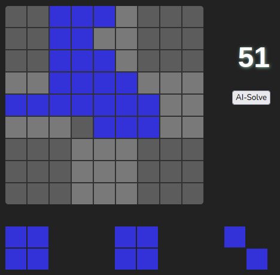

# Block-Puzzle



Try the demo at [https://schmikolai.github.io/block_puzzle/](https://schmikolai.github.io/block_puzzle/)

A simple debug mode can be enabled with the query parameter `?debug=true`

## Rules

- Earn points by strategically placing pieces on the grid.
- After placing all three pieces, a new set of three will appear.
- Clear a row, column, or 3x3 box by completely filling it to gain bonus points.
- The game ends when no available pieces can fit on the grid.

## AI Mode

The game can be played by the computer.  

It uses a simple search algorithm by evaluating every possible placement combination of the three current pieces.  

One optimization to reduce the number of evaluations is to discard moves where the placed piece would float without touching any other blocks or the grid border, as this is generally a poor move. However, this placement method could sometimes be used strategically to clear lines on the next move. As a result, this optimization may eliminate potentially better moves.  

I found that the game will run practically indefinitely.

Debug mode will plot the number of evalued moves.

## Development

### Install dependencies:

``` bash
npm install
```

### Start the development server:

``` bash
npm start
```

### Build the project:

``` bash
npm run build
```
